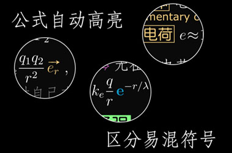

\\ent[LeNote]{狸笔记}
======

狸笔记（LeNote）是 LePtC 为整理物理数学笔记开发的 LaTeX 模版，主要特点有双语词条、自动高亮、图文混排、表文混排、紧凑版面、简化数理命令、强迫症友好型格式约定等…

LeNote is a LaTeX note template created by LePtC, for templating his physics and mathematics notes.

（此为狸笔记模版开发主页，狸笔记 pdf 文件主页 [戳这](http://leptc.github.io/lenote/) ）

(This is the homepage for LeNote template development,
for LeNote pdf files homepage
[click me](http://leptc.github.io/lenote/))

狸笔记的主要特性有：
LeNote provides the following features:

- 双语词条 CJK alphabet combined entry

- 自动高亮 Syntax highlighting

- 图文混排，表文混排 Picture, table mix with text

- 数理符号约定 Other symbol conventions in physics and math

详细指导见 sample 文件夹中的 LePtC.pdf 文件

Other details: see the LePtC.pdf in the sample folder.
(Currently in Chinese only)

Sample
======

打印效果 Print out style

反色效果（电脑上用 SumatraPDF 查看） Reverse color style (using SumatraPDF on PC)

更新日志
======

###2016.11.09

本次更新改动较大，主要是模版名由 `leptc` 改成了 `lenote`，安装过旧版 LeNote 的童鞋请修改文档的 `\documentclass`

因为重装系统，重新测试了一遍最新的 MikTeX 和 TeXLive，写了新版的说明书

###2016.02.16

leptc.sty：

- 增加 `\enlr` 命令，用于罗列多个定理或推论时的缩进排版
- 加入 `bm` 包，斜粗体注册为矩阵，命令为 `\bm`
- 更多矩阵运算符号 `\eig` `\cond`
- 更多概率统计符号 `\Ep` `\Dv` `\Cov`
- 增加张量分析用的单位基矢，克氏符号，黎曼曲率
- 增加四元数用的虚数单位
- 用 `\DeclareMathOperator` 代替蠢哭了的手打空格
- `xcolor warning` 已修正（貌似…）

leptc.cls：

- 加入页脚
- 加入公用图片路径

（最近比较懒，说明书等下一波再更新…）

###2015.11.13

将字体 `\mathsf` 注册为特殊数学运算（排列 A 组合 C ，转置 T）

自动高亮增加新成员：单位矢量

###2015.10.16

这两个月做了一些符号微调，没有大改动

###2015.08.12

加入 `physymb` 包，修复其与其他包的冲突，Griffiths 的相对位矢符号用 `\rr`

###2015.07.27

加入封面环境 `\begin{lecover}`

###2015.07.21

颜色改进，加深橙色从而更易读

###2015.07.13

新分支：lenote-日语（日文字体使用 [源柔ゴシック](http://jikasei.me/font/genjyuu/)）

###2015.06.30

加入子章节 `\chaps{}`

###2015.06.15

加入页码

###2015.06.14

加入 `ytableau` 包，绘制杨图 `\ynd`，绘制杨盘 `\yng`

###2015.06.08

提供 Sample 截图

###2015.05.29

更新 README，日志从今天开始写…

======

（萌狸的 LaTeX 属于现学现卖滴，模版可能开发的灰常不专业，欢迎提出指导意见～）

